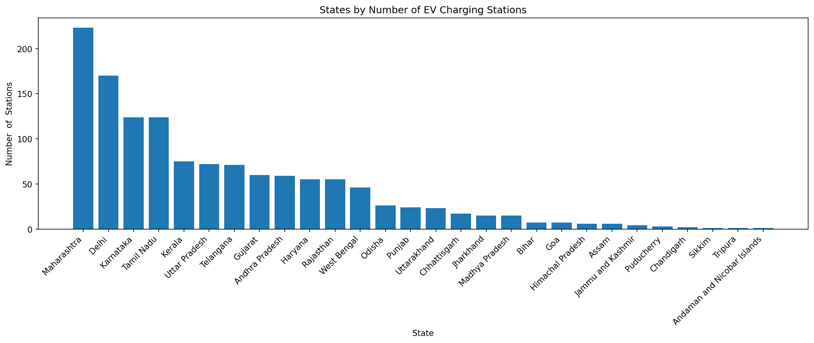
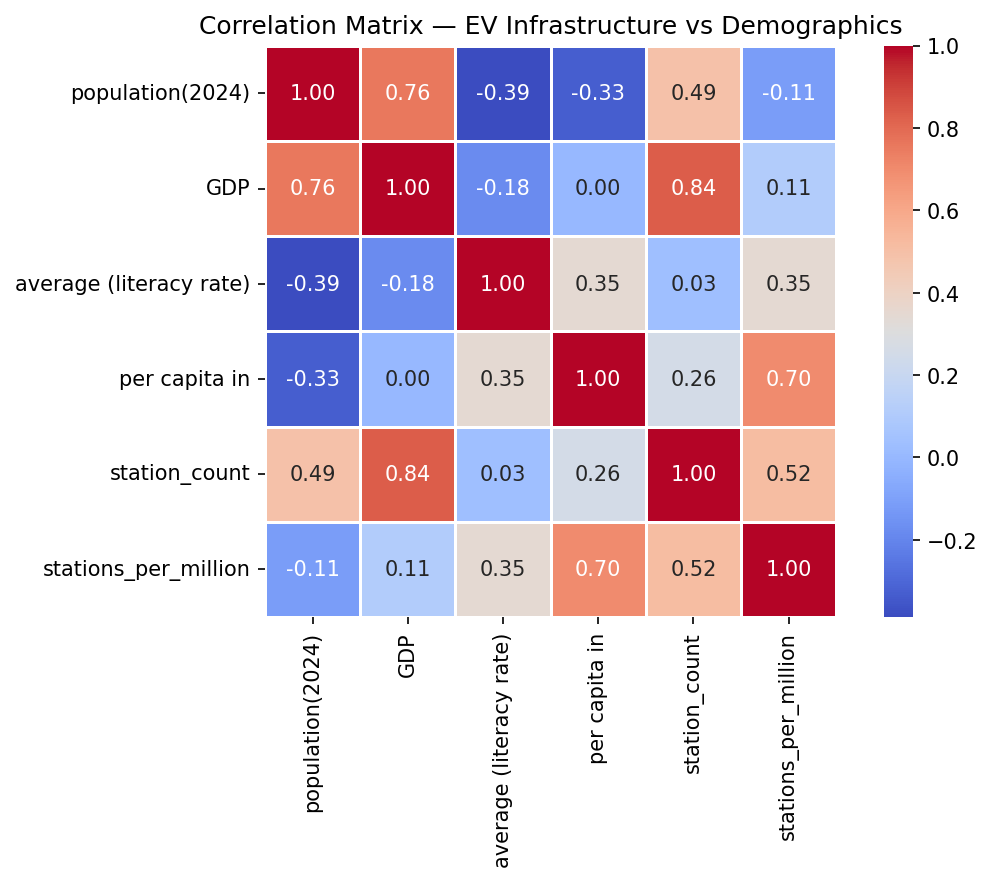
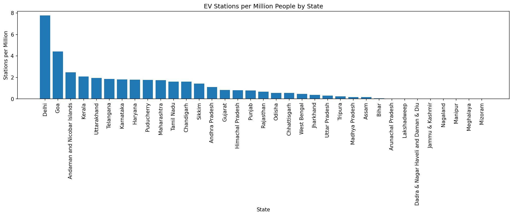
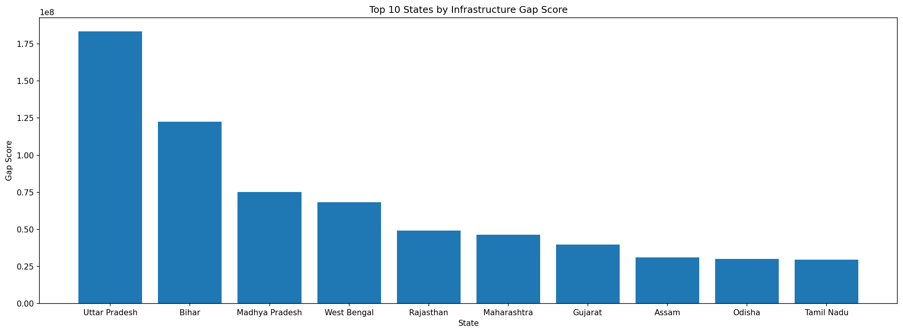

# India EV Infrastructure Analysis

**Author:** Shubham Banduni  
**Type:** Exploratory Data Analysis  
**Tools:** Python, Pandas, NumPy, Matplotlib, Seaborn

---

## Problem Statement

India's EV adoption is accelerating but charging infrastructure is unevenly distributed. This analysis identifies regional gaps and underserved markets to support data-driven expansion strategies for EV charging networks.

---

## Datasets

| Dataset | Source | Records |
|--------|--------|---------|
| EV Charging Stations in India | [Kaggle](https://www.kaggle.com/datasets/saketpradhan/electric-vehicle-charging-stations-in-india/data) | 1,547 stations |
| Indian States Population & Demographics | [Kaggle](https://www.kaggle.com/datasets/samyakjain2052/indian-states-population-gdp-religion-sex-ratio) | 35 states/UTs |

---

## Project Structure
```
India_EV_Infrastructure_Analysis/
├── data/
│   ├── ev_charging_stations_india.csv
│   └── statewise_pop.csv
├── images/
├── notebook/
│   └── eda.ipynb
└── README.md
```

---

## Analysis Overview

- **Section 1:** Data Loading & First Look
- **Section 2:** Data Cleaning — state/city name standardization, missing values, duplicates
- **Section 3:** Univariate Analysis — EV station distribution, population, literacy, GDP
- **Section 4:** Bivariate Analysis — GDP, population, literacy vs EV infrastructure
- **Section 5:** Gap Analysis — stations per million, overserved vs underserved, gap score
- **Section 6:** Key Findings & Conclusions
- **Section 7:** Future Scope

---

## Key Findings

- EV infrastructure is heavily metro-centric — Delhi, Mumbai, and Bangalore dominate
- GDP (correlation: 0.84) is the strongest predictor of EV station count
- Delhi leads on per capita basis with 7.8 stations per million people
- Uttar Pradesh, Bihar, and Madhya Pradesh have the highest gap scores — 45+ crore people with under 1 station per million
- Literacy rate has almost no correlation (0.03) with EV infrastructure

---

## Visualizations

### States by EV Station Count


### Correlation Heatmap


### Stations per Million by State


### Infrastructure Gap Score


---

## Notebook

📓 [View Notebook on nbviewer](https://nbviewer.org/github/ShubhamBanduni/India-EV-Infrastructure-Analysis/blob/main/notebook/eda.ipynb)

---

## How to Run

1. Clone the repository
2. Install dependencies: `pip install pandas numpy matplotlib seaborn`
3. Open `notebook/eda.ipynb` in Jupyter
4. Run all cells top to bottom

---

## Limitations

- Dataset covers only 1,305 stations — likely incomplete representation of actual infrastructure
- Some states showing 0 stations may reflect data gaps rather than absence of infrastructure
- Analysis is a static 2024 snapshot — EV infrastructure is growing rapidly
